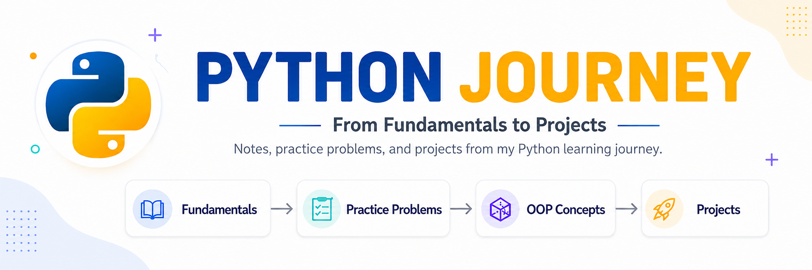

# 🐍 Python Journey

A personal repository documenting my Python learning journey — from understanding the fundamentals and solving practice problems to building complete Python applications.

<p align="center">
  
</p>

---

## 🚀 My Journey

I started with Python fundamentals and gradually moved into problem-solving, Object-Oriented Programming, file handling, exception handling, decorators, iterators, generators, and other advanced concepts.

Along the way, I focused on three things:

**Learn → Practice → Build**

This repository brings all three together through structured notebooks, coding problems, mini-projects, and larger applications.

---

## 📂 Repository Structure

```text
python-journey/
│
├── 01-notebooks/
│   └── 01-python-basics/
│
├── 02-practice-problems/
│   ├── 01-fundamentals-problems/
│   └── 02-advanced-problems/
│
├── 03-projects/
│   ├── 01-mini-projects/
│   └── 02-major-projects/
│
└── assets/
```

---

## 📓 01. Learning Notebooks

My structured Python notes and hands-on notebooks covering the language from fundamentals to more advanced concepts.

**Topics include:**

`Python Basics` · `Control Flow` · `Strings` · `Lists` · `Tuples` · `Sets` · `Dictionaries` · `Functions` · `Decorators` · `OOP` · `File Handling` · `Exception Handling` · `Advanced Concepts`

[Explore Learning Notebooks →](./01-notebooks/)

---

## 🧩 02. Practice Problems

Practice notebooks created to strengthen Python logic and problem-solving.

### Fundamentals

Covers problems based on variables, operators, loops, strings, collections, functions, OOP, exceptions, file handling, and related concepts.

[Explore Fundamental Problems →](./02-practice-problems/01-fundamentals-problems/)

### Advanced Practice

Additional problem-solving notebooks covering arithmetic, patterns, strings, lists, dictionaries, functions, classes, inheritance, and file handling.

[Explore Advanced Problems →](./02-practice-problems/02-advanced-problems/)

---

## 🛠️ 03. Projects

Projects are where I apply the concepts learned in the notebooks and practice sections.

### Mini Projects

- Quiz Game
- Number Guessing Game
- Rock Paper Scissors
- Dice Roller
- Cipher Encryption
- Credit Card Validator
- Banking Program
- Hangman
- ATM Simulation
- Custom Data Type with OOP
- Trivia Game
- Random Password Generator

[Explore Mini Projects →](./03-projects/01-mini-projects/)

### Major Projects

#### 💰 Personal Finance Tracker

A Python application for recording and managing personal financial data.

[View Project →](./03-projects/02-major-projects/01-personal-finance-tracker/)

#### ✅ To-Do List Manager

A Python application for managing tasks with persistent JSON-based storage.

[View Project →](./03-projects/02-major-projects/02-todo-list-manager/)

---

## 🎯 Current Direction

I am strengthening my Python foundation through consistent problem-solving and project work, while gradually moving toward **Machine Learning and AI Engineering**.

My focus is to build strong programming fundamentals first, then apply them to data, machine learning, NLP, and real-world applications.

---

## 🌱 What This Repository Represents

This repository is not just a collection of Python files.

It represents my progression from writing basic programs to understanding how larger programs are structured and built.

```text
Fundamentals
     ↓
Problem Solving
     ↓
Functions & Reusable Logic
     ↓
Object-Oriented Programming
     ↓
File & Exception Handling
     ↓
Advanced Python Concepts
     ↓
Projects
```

---

> **Learning Python one concept, one problem, and one project at a time.**
